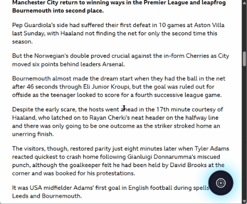
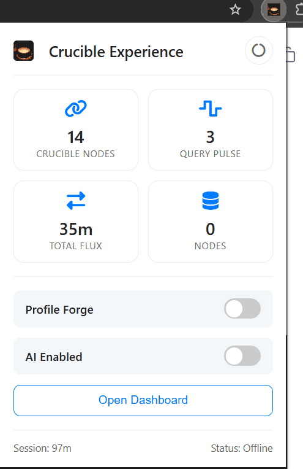
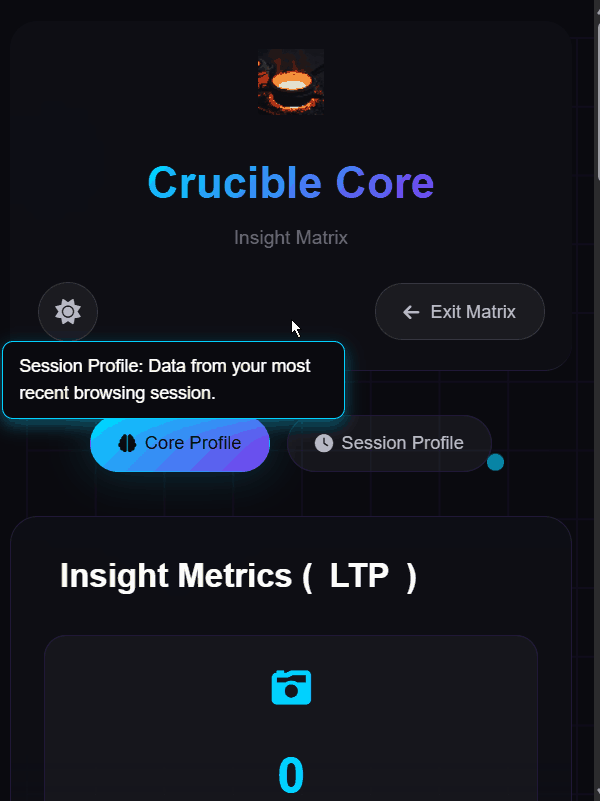

# Crucible 🔥
[](https://opensource.org/licenses/MIT)

> **Submission for the Google Chrome Built-in AI Challenge 2025**
> 
> Crucible is a Chrome extension powered by Gemini Nano. It privately learns your browsing habits to generate webpage summaries and insights that are *personalized to you*.

---

### 💡 Inspiration
While browsing every day, I noticed how much meaningful knowledge slips away—hidden between search results, news feeds, and articles. The web is vast, but our attention isn’t.

I wanted to create something that could think alongside me—a quiet intelligence that learns what I seek and surfaces the right insights when I need them. That idea became **Crucible**, named after the vessel where raw matter is transformed into something refined.

It represents the same transformation for knowledge: from scattered browsing behavior into distilled, personal understanding.

### 🔴 Note to Judges
The 3-minute submission video is a raw, no-audio screen capture due to the extreme time constraints of the hackathon.

**This README serves as the primary demonstration of the project's complex architecture and functionality.** The core of this project is its sophisticated, on-device user-profiling pipeline (STP/LTP), which is fully detailed below.

---

### 🚀 New Demo Video (Narrated)
Please watch this new 2-minute narrated walkthrough for a clear demonstration of the project's features and architecture:

[Watch the New Narrated Demo on YouTube](https://youtu.be/uK3ldFtVNsU)

---

### ⚙️ Live Features & UI Walkthrough

#### 1. The Overlay (Personalized Summary)
This is the core feature. The user clicks the floating Crucible Orb on a supported page.

**In the GIF:**
1.  The user clicks the orb.
2.  A "processing" animation appears.
3.  After some on-device analysis (which is cut short in the GIF), the personalized summary and key insights appear in the overlay.



#### 2. The Popup (Extension Controls)
This is the main control panel, accessed from the Chrome toolbar. From here, the user can:
* Globally enable or disable Crucible.
* Pause or resume AI analysis and profile building.
* Change the theme of the orb.
* Access the main Dashboard.



#### 3. The Dashboard (User Profile Hub)
This is the central hub for the user's profile. It shows the real-time data the extension has synthesized:
* The plain-English **AI-generated profile summary** (e.g., "User has a focused...").
* Key metrics (total sessions, preferred intent, etc.).
* The user's **Long-Term Profile (LTP)** topics.
* A history of recent **Short-Term Profiles (STPs)**.



---

### 🧩 How It Works: The Profile Pipeline
Crucible runs entirely on-device. Its "brain" is a four-stage pipeline that turns raw behavior into actionable insight.

#### Phase 1: Data Collection (Passive)
Two content scripts (`Search.js` and `behaviorMonitor.js`) are injected into active tabs to gather raw behavioral data:
* **Search Monitor:** Captures search queries and the results you click.
* **Behavior Monitor:** Tracks on-page engagement, including **active time** (via mouse/keyboard pings), scroll depth, clicks, copies, and highlights.
* **Database:** All raw data is stored locally in IndexedDB using Dexie.js.

#### Phase 2: AI Enrichment (Asynchronous)
An `AIQueue` schedules tasks to process raw data with **Gemini Nano** without blocking the browser:
* **For Searches:** Gemini Nano classifies the `intentType` (e.g., *transactional*, *informational*), `topicDomains`, `confidence`, and `specificity`.
* **For Page Behaviors:** A content sample from the page is sent to Gemini Nano to infer `topicDomains` and their `weights` (e.g., `[{topic: 'News', weight: 0.75}]`).

#### Phase 3: Profile Synthesis (STP → LTP)
When a new session begins, the data from the *previous* session is processed to build and update the user's profile.

1.  **Short-Term Profile (STP) Generation:**
    * The `buildSTP` function (from `stp logic.txt`) gathers all enriched data from the last session.
    * It calculates key metrics like `engagement_confidence`, `topic_cumulative` (raw topic scores), `intent_focus`, and `diversity_entropy` (focus vs. exploration).

2.  **Long-Term Profile (LTP) Update:**
    * The new STP is passed to the `LTPBuilder` (from `ltp.txt`).
    * **Time Decay:** Existing LTP topic scores are first decayed using an exponential decay function (`e^(-λ * Δt)` where `λ = 1/30` days). This ensures old, unvisited topics naturally fade.
    * **EWMA Integration:** The new (decayed) LTP and the new STP scores are merged. Key metrics like `ewma_focus` (long-term engagement) and `ewma_depth` are updated using an **Exponentially Weighted Moving Average (EWMA)**. This provides a smooth, stable, long-term picture of user preferences.
    * **AI Summary:** Gemini Nano is used to create plain-English summaries of the STP and LTP, which are stored in the user's profile.

#### Phase 4: Personalized Generation (Active)
When the user clicks the Crucible Orb:
1.  **Content Extraction:** The page's main content is extracted using a strict query selector hierarchy (e.g., `<article>`, `<main>`).
2.  **Chunking & Ranking:** The text is split into chunks, which are then scored and ranked against the user's **STP/LTP profile** to find the most relevant content.
3.  **Multi-Stage Generation:**
    * **Step 1:** The top *N* relevant chunks are sent to Gemini Nano (along with the user's profile summary) to generate *profile-biased summaries*.
    * **Step 2:** These individual summaries are combined and sent back to Gemini Nano for a final "summary of summaries."
    * **Step 3:** A final prompt generates "Key Insights" that map the page's main themes directly to the user's known interests.

---

### 🛠️ Installation
To install and run this extension locally:

1.  **Clone the repository:**
    ```bash
    git clone [https://github.com/Shantanu-00/crucible-chrome-extension](https://github.com/Shantanu-00/crucible-chrome-extension)
    ```
2.  **Open Chrome Extensions:**
    * Navigate to `chrome://extensions/` in your Chrome browser.
3.  **Enable Developer Mode:**
    * Find the **Developer Mode** toggle in the top-right corner and turn it on.
4.  **Load the Extension:**
    * Click the **Load unpacked** button.
    * Select the project folder you just cloned.

---

### 🧰 Tech Stack
* **AI:** Google Gemini Nano (via the built-in Chrome API)
* **Platform:** Chrome Extensions (Manifest V3)
* **Database:** IndexedDB (with Dexie.js wrapper)
* **Core Logic:** JavaScript (ESM)
* **UI:** HTML, CSS

---

### 🚧 Challenges & Future Work

As a solo developer who joined the challenge, this entire project—from data collection to the STP/LTP pipeline—was built in an **intense 15-day sprint**. The entire focus was on building the complex, end-to-end personalization and profiling engine.

#### Known Limitations
* **Cold Start Problem:** The profiling model requires ~3 "high-confidence" browsing sessions to build a meaningful baseline LTP.
* **Content Extraction:** The current rule-based extractor fails on complex DOMs (like Wikipedia).
* **Session Handling:** Low-quality or empty sessions are sometimes processed, which can temporarily create a "analysis in progress" profile.

#### What’s Next
* **Solve the Cold Start:** Implement an onboarding flow where users can select their initial interests to seed the LTP.
* **Improve Content Extraction:** Move from a static selector list to a density-based or ML-model-based content extractor that works on *any* page.
* **Real-Time Updates:** Refactor the profile pipeline to update in real-time.
* **Evolve to a "Personal AI Node":** The ultimate vision for Crucible. This involves:
    * **Advanced Profile Synthesis:** Evolving the LTP from a simple list of topics into a rich, "digital twin" of the user's knowledge and interests.
    * **Meta-Prompt Generation:** Using this "digital twin" to dynamically generate complex meta-prompts for Gemini Nano.
    * **The Future of Fine-Tuning:** The final step would be to use future on-device APIs to *truly* fine-tune the local model itself, creating a personalized AI that learns and adapts exclusively for the user, with perfect privacy.

---
### 🧑‍💻 Author
* **Shantanu**
